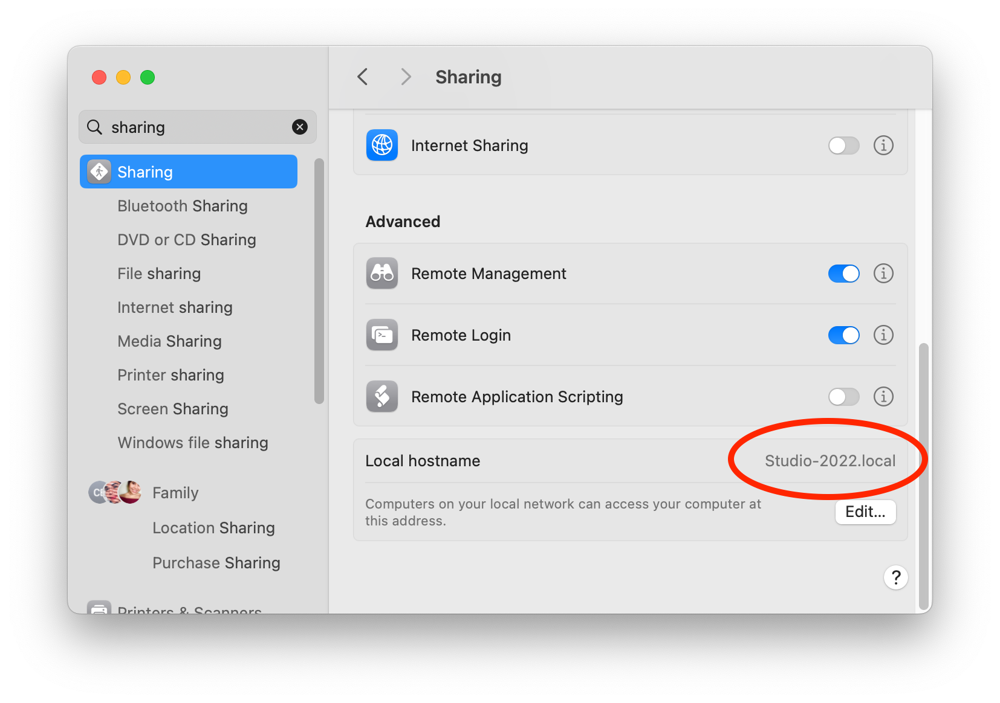
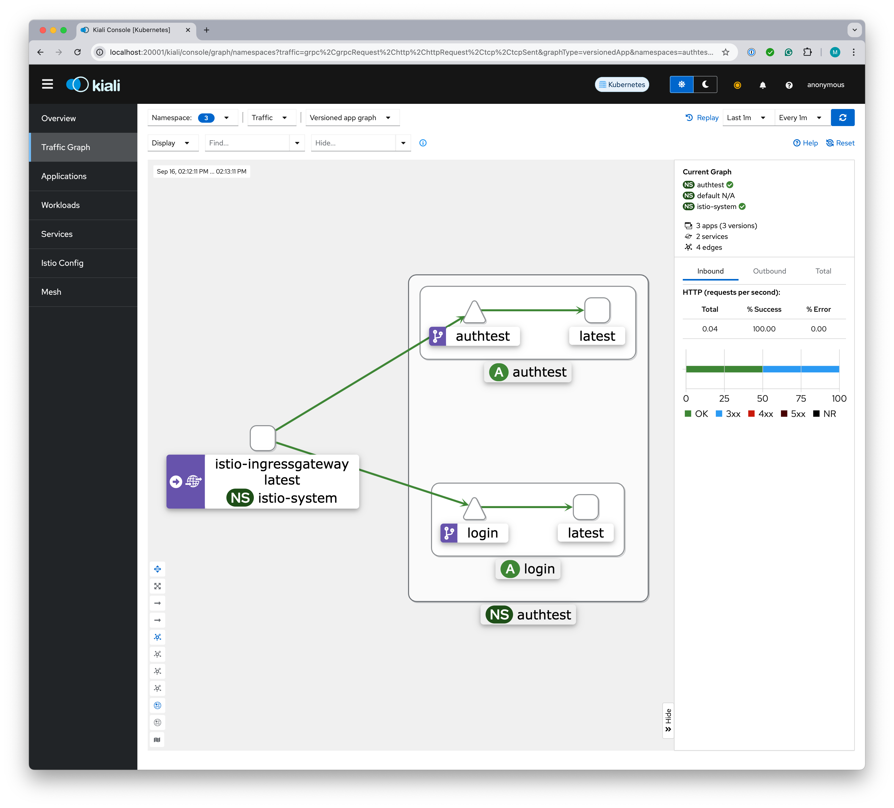

# Running Istio on Minikube locally

## Objective

Demonstrate how Istio can be deployed on top of Minikube to:

1. Manage path routing for a trivial two service web application
2. Demonstrate the configuration of the Istio ingress gateway to utilize an [Envoy external authorization filter](https://www.envoyproxy.io/docs/envoy/latest/configuration/http/http_filters/ext_authz_filter)
   to evaluate requests and modify both request and response headers. 

Login and logout is crudely illustrated by the creation and removal of a session cookie containing the username.
This is clearly not a secure pattern; do not use it for anything more than demonstration purposes.

**NOTE:** While it would be possible to perform much if not all of the Kubernetes and Istio configuration with just one
or two manifest YAML files, this project takes an incremental approach of building up the cluster one Lego brick at a 
time with smaller, single purpose YAML files and single `kubectl`/`istioctl` commands rather than scripts. 

If it looks like this project was assembled brick-by-brick, that's because it's true; learning how
to configure Kubernetes and Istio was achieved one small step at a time.

## `something.local` vs `localhost`

The Istio ingress gateway cannot support routing to overlapping wildcard host domains. In other words, it will happily 
support `*.example.com` and `*.other.com`, routing requests for those host name families to services running in
two respective Kubernetes namespaces, but it cannot separately route to `*` and `*.example.com` where 
`*.example.com` is a subset of `*`. 

It is also illegal to specify host name patterns with only a single element such as `localhost`. The only way for
the Istio ingress gateway to support routing to `localhost` is to define a gateway for `*`, i.e., for all hosts. 
And if you do that then you cannot configure a second gateway since `*` is the superset of all domain name patterns. 

### Knative Serving of public services

Running Knative Serving to host on-demand loading of publicly accessible services alongside non-Knative services in 
the same cluster requires multiple Istio ingress gateway configurations, at least one for Knative services and at least
one for non-Knative services. 

Since this guide is intended to serve as a foundation for the follow up [Running Knative on Minikube locally](https://github.com/mikebway/knative-poc) 
guide, we cannot use a `*` wildcard host specification in the Istio [`gateway.yaml`](../istio/gateway.yaml) configuration.

If you are not going to be installing [Knative](https://knative.dev/docs/) into your Minikube cluster, i.e. you
are not going to add [Running Knative on Minikube locally](https://github.com/mikebway/knative-poc) after you
complete this guide, then you can alter the `hosts` entry of [`gateway.yaml`](../istio/gateway.yaml) to allow the 
Istio ingress gateway to route for any target host name including `localhost` as follows:

Replace this:

```text
      hosts:
        - "*.local"
```

with this:

```text
      hosts:
        - "*"
```

### Finding your Mac's `.local` name

If you are using a Mac and sticking with the provided [`gateway.yaml`](../istio/gateway.yaml) file for `*.local` hosts
you will need to find out what your Mac's local DNS name is. You can do that by looking at the bottom of the **Sharing**
panel of your **System settings**:



In this example, the Mac's local DNS host name is `Studio-2022.local`; case does not matter.

## Installation and configuration

1. [Minikube installation and basic configuration](Install.md)
2. [Build and deploy the authtest service](svc-authtest.md)
3. [Build and deploy the login service](svc-login.md)
4. [Configure Istio ingress](istio.md)
5. [Configure Istio service mesh](mesh.md)
6. [Configure Istio visualization](visualize.md)<p>
   **Optional:**
7. [Build and deploy the ingress authorization filter](svc-extauth.md)
8. [Configure the ingress authorization policy](authz-policy.md)

## Trouble shooting

To follow the Istio ingress gateway access logs, first find the full name of the currently active ingress gateway pod
as follows:

1. List the pods running in the `istio-system` namespace with this command:
   ```shell
   kubectl get pods --namespace istio-system
   ```
   yielding something like this:
   ```text
   NAME                                    READY   STATUS    RESTARTS       AGE
   istio-egressgateway-55d6d944d7-6txh5    1/1     Running   8 (22h ago)    15d
   istio-ingressgateway-7968d6d777-26xll   1/1     Running   8 (22h ago)    15d
   istiod-5cc65d99d5-s2rdf                 1/1     Running   8 (22h ago)    15d
   kiali-65c46f9d98-brd54                  1/1     Running   19 (22h ago)   15d
   prometheus-7979bfd58c-8gk4x             2/2     Running   19 (22h ago)   15d
   ```
2. Copy and paste the full name of the `istio-ingressgateway` pod to replace `istio-ingressgateway-7968d6d777-26xll` 
   in the following command:
   ```shell
   kubectl logs istio-ingressgateway-7968d6d777-26xll --namespace istio-system -f
   ```
   Drop the `-f` if you just want to view a snapshot of the most recent logs. 


## Testing without the authorization filter

After completing installation and configuration through step 6 you should be able to:

1. Start a tunnel to connect localhost port 80 to the cluster ingress gateway (if you have not already done this).
   Doing so will block in that shell until you Ctrl-C to quit it.
   ```shell
   minikube tunnel
   ```
   If you get an error starting the tunnel to the effect `... another tunnel is already running ...` when you
   don't have the tunnel in another shell window, delete the local file found at:
  ```shell
  rem .minikube/profiles/minikube/.tunnel_lock
  ```
   If you close a shell window without Ctrl-C shutting down an open tunnel, the lock file can be left in place even
   though the tunnel is not running.
   
2. Point a browser to http://<your-system-name>.local and see a simple text response that looks something like this, echoing the `/`
   path of your request and a count 1 times that the [authtest](../authtest) service has responded to a request.
   ```text
   Path:		"/"
   Count:		1

   HEADERS (25)
   =======

   Accept: [text/html,application/xhtml+xml,application/xml;q=0.9,image...
   Accept-Encoding: [gzip, deflate, br, zstd]
   Accept-Language: [en-US,en;q=0.9]
   Cache-Control: [max-age=0]
   Sec-Ch-Ua: ["Chromium";v="128", "Not;A=Brand";v="24", "Google Chrome...
   Sec-Ch-Ua-Mobile: [?0]
   Sec-Ch-Ua-Platform: ["macOS"]
   Sec-Fetch-Dest: [document]
   Sec-Fetch-Mode: [navigate]
   Sec-Fetch-Site: [none]
   Sec-Fetch-User: [?1]
   Upgrade-Insecure-Requests: [1]
   User-Agent: [Mozilla/5.0 (Macintosh; Intel Mac OS X 10_15_7) AppleWe...
   X-B3-Sampled: [0]
   X-B3-Spanid: [70b28d3aafbee86f]
   X-B3-Traceid: [a0305281afeff95b70b28d3aafbee86f]
   X-Envoy-Attempt-Count: [1]
   X-Envoy-Decorator-Operation: [authtest.authtest.svc.cluster.local:80...
   X-Envoy-Internal: [true]
   X-Envoy-Peer-Metadata: [ChoKCkNMVVNURVJfSUQSDBoKS3ViZXJuZXRlcwodCgxJ...
   X-Envoy-Peer-Metadata-Id: [router~10.244.0.16~istio-ingressgateway-8...
   X-Forwarded-For: [10.244.0.1]
   X-Forwarded-Proto: [http]
   X-Request-Id: [90ee77dd-0395-42be-8148-bcc766f0f246]
   ```
   In addition, an `authtest-request` cookie will be set, containing the path requested and the count of requests
   handled. 
   
3. Repeating with different URL paths (other than `/login` and `/logout`) will show the `Path:` value changing the
   to match and the `Count:` value increasing, i.e. the count of times that the [authtest](../authtest) service
   has responded to a request.
   
4. Going to `http://<your-system-name>.local/login` will prompt you to add a `user=` query parameter:
   ```text
   To login, add a user=username query parameter to this ULR path
   ```
   
5. Going to `http://<your-system-name>.local/login?user=micky-mouse` will create a `session` cookie containing that name and
   redirect to http://<your-system-name>.local/dashboard.
   
6. Going to `http://<your-system-name>.local/logout` will reset the session cookie and, in effect, "log you out," and display: 
   ```text
   user micky-mouse has been logged out
   ```
7. Returning to any non `/login` or `/logout` path will again display the [authtest](../authtest)
   response but with the session cookie removed or at least emptied (the behavior depends on the browser type used).

## Testing with the authorization filter

If the installation and configuration is completed through stages 7 and 8, then two additional headers will be found in 
the http://<your-system-name>.local/whatever echo text:  

* `X-Extauth-Was-Here` containing the text `blah, blah, blah`
* `X-Extauth-Authorization` containing a JWT bearer token

**NOTE:** The `extauth` ingress filter is configured to allow home page requests, i.e., to the `/` path to pass through
without setting these headers. The headers will only be set on non-root URL paths.

Pasting the JWT text from the `X-Extauth-Authorization` into the JWT debugger form at https://jwt.io, the payload will 
be seen to contain the username copied from the session cookie. The payload portion of the JWT will look something like 
this after visiting http://<your-system-name>.local/login?user=micky-mouse:

```json
{
  "exp": 1726777195,
  "iat": 1726777165,
  "nbf": 1726777165,
  "sub": "micky-mouse"
}
```

The `X-Extauth-Was-Here` and `X-Extauth-Authorization` headers are set on the inbound request that ingress will
forward on to the the [`authtest`](../authtest) and [`login`](../login) services. These headers will not be present 
on the response back to the browser. 

An `extauth` cookie will be sent back to the browser, containing the total count of requests that the [`extauth`](../extauth)
filter has approved.

## Visualizing the service mesh

Assuming that you have started the Kiali dashboard web app as described under [Configure Istio visualization](visualize.md),
you should now be able to see a picture of the service mesh at http://localhost:20001/kiali/console/graph/namespaces.
If nothing shows up, make sure that you **Select all** check in the Namespace dropdown.



## Suspending Minikube

You can stop Minikube and Colima to get your memory and CPU back at any time by killing any `minikube dashboard` and
`minikube tunnel` shell commands that you have running with Ctrl-C and then execute the following:

```shell
minikube stop

colima stop
```

The next time you start Minikube, the services that you deployed will be brought back to life; you do not
have to go through the installation and deployment steps again. For example:

```shell
colima start -c6 -m12 

minikube start

# Don't forget to start the tunnel back up as well!
minikube tunnel
```
