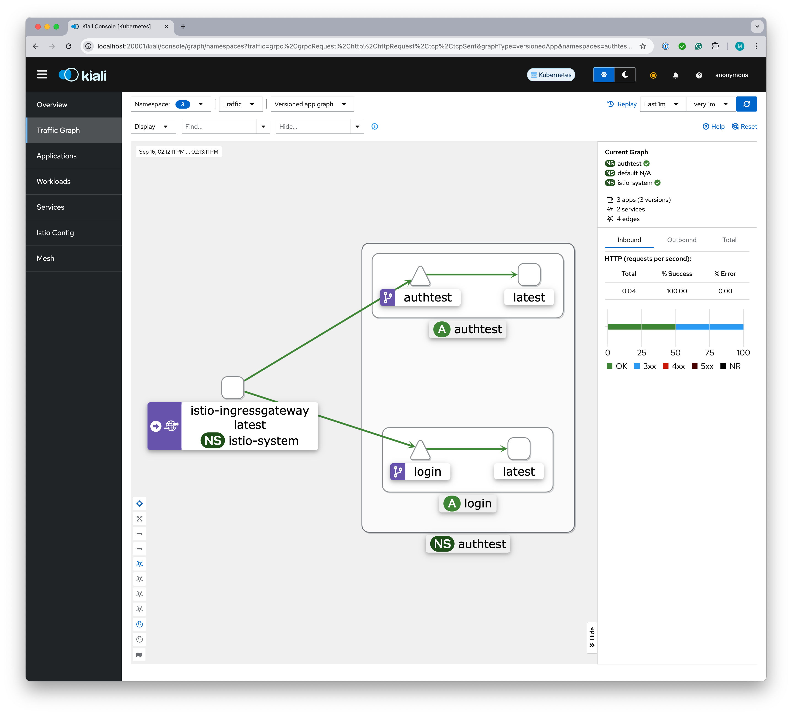

# Adding Istio Metrics and Visualization

[Kiali](https://istio.io/latest/docs/ops/integrations/kiali/) provides multiple ways to visualize your service
mesh and the traffic patterns that it experiences. To use Kiali, you must first install [Prometheus](https://istio.io/latest/docs/ops/integrations/prometheus/)
telemetry collection. This is very easy to do, but first you need to know which version of Istio you are running:

```shell
istioctl version
```

Most likely, all three versions displayed are the same. If in doubt, go by the the control plane version:

```text
client version: 1.23.1
control plane version: 1.23.1
data plane version: 1.23.1 (4 proxies)
```

With the version number in hand, run the following commands to install Prometheus and Kiali, modifying the `release-1.23`
to match the major version numberingg that you found in the output of the `istioctl version` command:

```shell
# Install Prometheus telemetry for Istio
kubectl apply -f https://raw.githubusercontent.com/istio/istio/release-1.23/samples/addons/prometheus.yaml

# Install the Kiali mesh visualisation
kubectl apply -f https://raw.githubusercontent.com/istio/istio/release-1.23/samples/addons/kiali.yaml
```

Now you can start Kiali; the following will run the Kiali service and open a browser to it:

```shell
istioctl dashboard kiali
```

There will not be much to see if you have not sent any requests into the cluster recently, so hit a few URLs across
the [`authtest`](../authtest) and [`login`](../login) services:

* http://example.com/blah-blah-blah
* http://example.com/logout
* http://example.com/login?user=donald-duck

Then look at the various traffic graphs that you can explore from here (don't forget to specify the `authtest` 
namespace, or all namespaces): 

* http://localhost:20001/kiali/console/overview?duration=60&refresh=60000

If nothing shows up, make sure that you **Select all** check in the Namespace dropdown.



